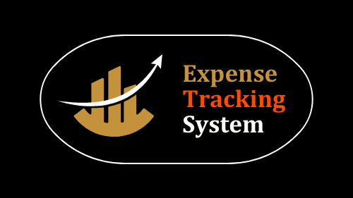

# Expense Tracking System


Streamlit serves as the frontend application for this project, 
and Fastapi serves as the backend server. 
The project was designed to be an expense tracking system.

## Project Structure
- **backend/**: Contains the FastAPI backend server code.
- **frontend/**: Contains the Streamlit application code.
- **images/**: Contains all the images.
- **tests/**: Contains the test cases for both frontend and backend code.
- **README.md**: It gives an overview of the project as well as instructions for it. 
- **requirements.txt**: Provides a list of the necessary Python packages. 

## Setup Instructions
1. **Clone the repository:**
    ```commandline
   git clone https://github.com/RAWhulKerudi/Expense-Tracking-System.git
   ```
2. **Install dependencies:**
    ```commandline
   pip install -r requirements.txt
   ```
3. **Run the FastAPI server:**
    ```commandline
   uvicorn server:app --reload
   ```
4. **Run the Streamlit app:**
    ```commandline
   streamlit run frontend/main.py
   ```
